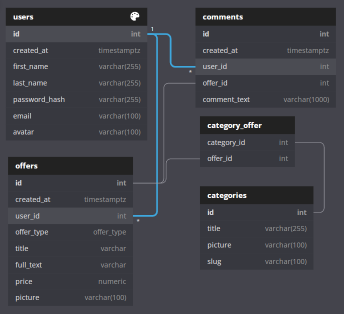
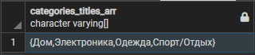
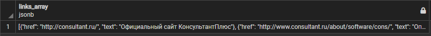
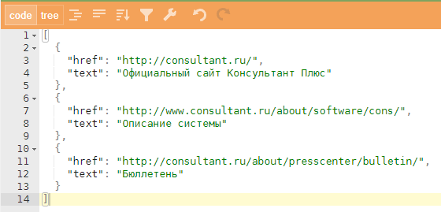

# Тестовое задание 

Задания направлены на проверку ваших текущих навыков, умение быстро обучаться и гуглить. 
При проверке будут оцениваться чистота кода, использование принятых в отрасли стандартов и выполнение условий задачи. Выполненное тестовое задание будет использоваться в ходе собеседования. 
Выложите готовое задание в свой гитхаб-репозиторий и пришлите нам ссылку на него. 

Ждём ваше выполненное задание в течение 7 - 10 дней после получения ссылки.

---

## Frontend-модуль

Сверстайте лендинг по [макету](https://www.figma.com/file/fY6qxsy8UQ6nUxDN1yMpDQ/School-Recover---html-website-template-for-school-(Community)-(Copy)-(Copy)?node-id=2415%3A26437). 

Используйте Bootstrap, мы применяем его в работе. PixelPerfect не требуется. 
Адаптация страницы под 3-4 разрешения будет вам плюсом 🙂

Подключите в своём репозитории Github Pages, чтобы можно было посмотреть как саму страницу, так и код проекта.

---

## Backend-модуль

### Описание модели данных

Есть схема базы данных для сайта объявлений, похожего на Avito, со следующими сущностями:

1. Пользователи (users): 
    - регистрируются на сайте, 
    - у одного пользователя может быть много или ни одного объявления,
    - комментируют объявления других пользователей.

1. Категории (categories): 
    - типы, по которым группируются объявления.

1. Объявления (offers):
    - относятся к одной или большему количеству категорий,
    - тип объявления (offer_type) может быть либо 'buy' (Куплю), либо 'sell' (Продам); 

1. Комментарии (comments):  
    - одноуровневые, т.е. пользователи не могут комментировать комментарии других пользователей.

1. Категория-Объявление (category_offer): 
    - таблица связей между категориями и объявлениями,
    - содержит только актуальные связи.

*Схема сущностей базы данных*:

По предложенной диаграмме напишите SQL-запросы.

> Выполнение всех запросов не обязательно, сделайте столько, сколько сможете, но чем больше вы сделаете, тем лучше.
> Задачи разработаны для среды PostgreSQL.
> Важны именно сами запросы, даже демонстрация хода мыслей.

### Обязательная часть

#### Задание 1

Выберите список всех комментариев, созданных пользователями с идентификаторами 1 и 2. 
Поля для вывода: id, created_at, user_id, comment_text.

#### Задание 2

Выведите список объявлений (id, created_at, user_id, offer_type, title, price, picture), 
опубликованных в октябре 2021 года с сортировкой по дате публикации от самых свежих к более поздним. 
Дату публикации выведите в формате 'DD.MM.YYYY'.

#### Задание 3

Выберите список пользователей, которые ещё не опубликовали ни одного объявления. 
Поля для вывода: идентификатор пользователя, email, дата регистрации, имя и фамилия одной строкой как столбец 'user_name'. Отсортируйте по возрастанию даты регистрации.

#### Задание 4

Выберите среди всех объявлений на продажу товары с максимальной стоимостью, количество ограничивать не нужно.
Выведите их идентификатор, имя и фамилию автора, заголовок и цену продажи. 

#### Задание 5

Для вывода на сайте выберите список всех категорий, в которых есть хотя бы одно объявление с указанием количества объявлений по каждой категории. Выведите id категории, title, slug, количество объявлений (offer_amount).

### Хардкор-задания для уверенных пользователей SQL

Выполнение необязательно, но покажет уровень ваших знаний. Чем больше заданий вы выполните, тем лучше.

#### Задание 6

Выберите список объявлений, относящихся к категории 1 ('Вещи'). 
Выведите данные объявления (id, created_at, offer_type, user_id, title, price) и список всех категорий объявления в виде массива (как столбец category_list). Тип объявления выведите по-русски: если тип buy, то выведите 'Куплю', если sell - 'Продам'. Отсортируйте по дате создания в обратном порядке. 
Выведите следующие 2 объявления после первых 2.

#### Задание 7

Напишите функцию на pl/pgsql, которая принимает дату и время публикации объявления (столбец created_at) и возвращает "давность" публикации, например: 2 дня назад, 10 часов назад и т.п. Ограничьтесь днями, часами и минутами.

#### Задание 8

Выведите список пользователей (id, first_name, last_name, email), количество объявлений, созданных ими (offer_amount), и количество комментариев, созданных для этих объявлений (comments_amount). 
Результат отсортируйте по убыванию offer_amount.

#### Задание 9

Реализуйте выдачу результатов поиска по объявлениям с помощью функции на pl/pgsql. 
Функция должна принимать следующие параметры на входе: 
- тип (buy, sell), 
- дата публикации,
- категория (id), 
- строка для поиска по заголовку, 
- строка для поиска по тексту объявления,
- стоимость.

Функция должна возвращать набор строк: список объявлений, соответствующих фильтрам.
Поля для вывода: идентификатор объявления, дата публикации, тип, автор (имя, фамилия), заголовок, анонс, стоимость. Анонс - это полный текст объявления, обрезанный до 30 символов, с добавлением '...' в конце строки.

#### Задание 10

Напишите запрос, который по массиву идентификаторов категорий соберёт массив названий соответствующих категорий. 
Пример: на входе массив `ARRAY[1, 2, 5, 7]`, на выходе массив строк: `{Вещи,Дома,Услуги,Машины}`. Отсортируйте названия категорий в массиве по алфавиту,

#### Задание 11

Соберите мини-отчёт: реализуйте выборку количества объявлений по месяцам 2021 года. 
Поля для вывода: year, monthname, offers_amount. 
Отсортируйте отчёт по месяцам по возрастанию.  

#### Задание 12

Реализуйте запрос из пункта 11 с добавлением нарастающего итога по месяцам. 
Те же столбцы + столбец offers_sum.

#### Задание 13

Соберите jsonb-массив всех комментариев для объявления с id 1. 
Каждый комментарий должен быть представлен jsonb-объектом со следующими данными: id комментария, текст, дата создания, id пользователя, создавшего комментарий, фамилия и имя одной строкой, ссылка на аватар.

Пример вывода:

Или в развёрнутом виде:

> Количество реализованных запросов покажет ваш уровень владения SQL.
> Результат выполнения задания соберите в файл, для каждого запроса укажите номер и текст описания задачи, 
> и выложите в гитхаб. 
